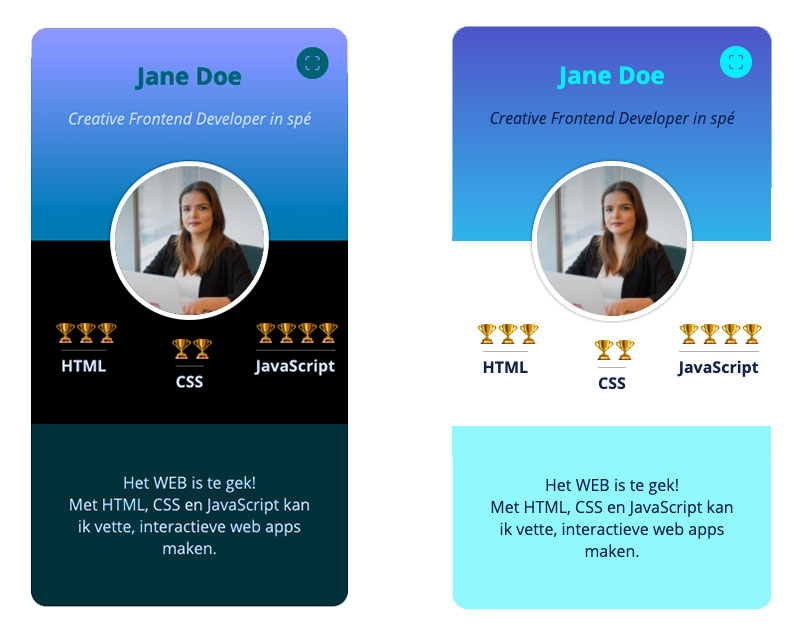

<link rel="stylesheet" href="https://tasks.fdnd.nl/global.css">

# Visitekaartje Experiment
Je hebt een eerste versie van je visitekaartje gemaakt waar je tevreden over bent, dus nu is er ruimte om te experimenteren met toffe CSS features en eventueel met JavaScript. Maak jij een 3D versie van je visitekaartje? Of regel je een dark-mode theme met blend modes? Duik je in een van de nieuwe browser API's en waag je je naast CSS aan JavaScript? Bij deze leertaak mag je out-of-the-box denken!

## Context

Leertaak: Experimenteer met CSS features om je visitekaartje nog toffer te maken. Deze leertaak hoort bij sprint 1 "Your Tribe". Dit is een _experimenteer_ taak.

## Briefing
Elke frontender bij [FDND](https://fdnd.nl) stelt zichzelf binnen de tribe voor door middel van een visitekaartje. Als het goed is heb je al op basis van de [duplicate leertaak](https://github.com/fdnd-task/fdnd-net-presence-duplicate) een eerste versie van je visitekaartje gemaakt. Bij deze leertaak doorloop je alle stappen van de development-lifecycle met als resultaat een experimentele versie van jouw visitekaartje, gepubliceerd via Github pages. Het Web is constant in beweging en dat geldt ook voor de ontwikkeling van CSS. Experimenteren met nieuwe features (of je verdiepen in reeds bestaande features) is een belangrijke competentie van een Frontender!

## Doel van deze leertaak
*Wat leer je in deze taak*

* Experimenteren met (nieuwe) CSS features
* De (on)mogelijkheden van CSS beter leren kennen

## Materiaal
Hieronder vind je een aantal bronnen die je kunt gebruiken bij het maken van ontwerpbeslissingen en het implementeren van jouw ontwerp.

Bronnen

  
* Typography: [CSS Text Effects](https://freefrontend.com/css-text-effects/]

## Werkwijze
Volg onderstaand stappenplan binnen de [**development-lifecycle**]() _[nog linken]_ om jouw visitekaartje gestructureerd te herontwerpen, aan te passen en op Github te publiceren.

Stappenplan

### Analyseren
*In de analysefase inventariseer je wat er moet gebeuren om een taak uit te voeren en formuleer je een aantal uitgangspunten waar je ontwerp aan moet voldoen.* 

Voor het uitvoeren van deze taak nemen we een aantal stappen, we gaan:
1. een aantal ontwerpbeslissingen nemen op basis van de uitleg
2. die beslissingen inbouwen in het bestaande visitekaartje
3. jouw visitekaartje publiceren via Github pages
4. het visitekaartje testen op klasgenoten
5. het proces documenteren in de [README.md](../README.md)

---

### Ontwerpen
*In de ontwerpfase maak je meerdere ontwerpen (divergeren) en neem je vervolgens beslissingen (convergeren) op basis van de door jou geformuleerde uitgangspunten. Je zorgt je dat je precies weet wat je moet gaan bouwen.*

In de workshop *Trucjes met CSS 1* heb je een aantal inspirerende voorbeelden gezien van ontwerpen gerealiseerd met CSS. Ontwerp een nieuwe versie van je visitekaartje en probeer hierbij, net als bij de voorbeelden is gedaan, out-of-the-box te denken. 

[Hierboven](/#materiaal) staan de in de workshop getoonde voorbeelden voor als je nog even rustig wil kijken. Je kan natuurlijk ook zelf zoeken naar inspirerende voorbeelden; google bijvoorbeeld op *'Cool CSS tricks 2021'*...

Pak een A4 en maak een aantal schetsen aan de hand van het template. 

Na bovenstaande stappen zorgvuldig doorlopen te hebben weet je ongeveer wat je gaat bouwen. Je kunt nu goed voorbereid door naar de volgende fase.

---

### Bouwen
*In de bouwfase realiseer je de beslissingen uit de ontwerpfase.*

#### Een ontwerp realiseren

Heb je een mooi ontwerp gemaakt van jou visitekaartje op basis van een van de inspirerende voorbeelden? Onderzoek hoe het voorbeeld is gemaakt door het lezen van de tutroial als dat er bij zit, of als er geen tutorial is door gebruik te maken van de *DevTools* van je browser.

---

### Integreren
*In de integratiefase voer je de aanpassingen door zodat iedereen ze kan zien.*

Je gaat jouw aanpassing op het visitekaartje publiceren op internet! Doorloop hierbij dezelfde stappen als bij de [duplicate leertaak](https://github.com/fdnd-task/fdnd-net-presence-duplicate).

Als het goed is gegaan kan je binnen enkele momenten jouw visitekaartje bekijken via de URL: [https://username.github.io/fdnd-visitekaartje-experiment/](https://username.github.io/fdnd-visitekaartje-experiment/).

Bekijk jouw visitekaartje even uitgebreid, ga daarna verder met de volgende fase.

---

### Testen
*In de testfase controleer je of jouw aanpassingen werken zoals bedoeld.*

Laat jouw visitekaartje testen door een paar klasgenoten en jouw docent. Noteer wat ze er van vinden. Ben je tevreden met het resultaat? Zo niet herhaal dan bovenstaande stappen.

---

## Criteria
Je bent klaar als je jouw proces (ontwerpbeslissingen, schetsen, inzichten en testresultaten) hebt gedocumenteerd in de [README.md](../README.md) in jouw *fork* van deze repository. Ook moet jouw visitekaartje bereikbaar zijn via gh-pages.

